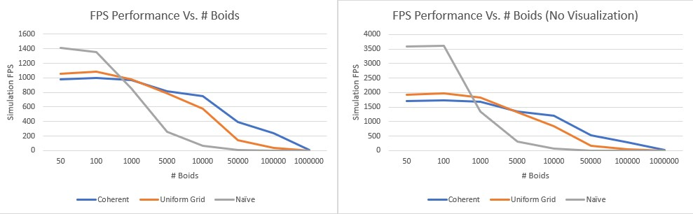
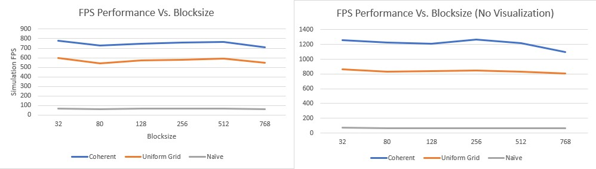
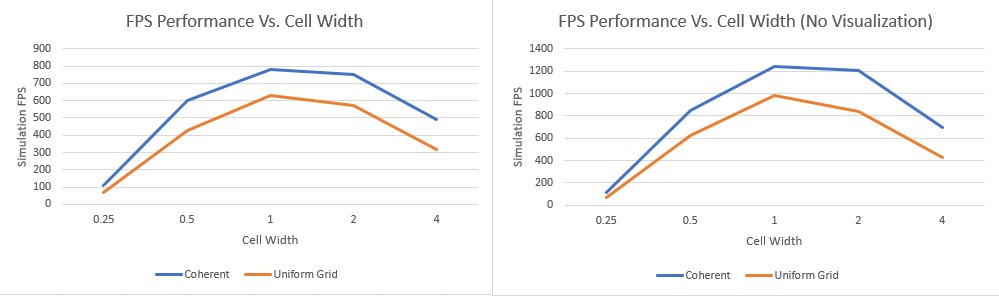

**University of Pennsylvania, CIS 565: GPU Programming and Architecture,
Project 1 - Flocking**

Peyman Norouzi
* [LinkedIn](https://www.linkedin.com/in/peymannorouzi)
* Tested on: Windows 10, i7-6700 @ 3.40GHz 16GB, Quadro P1000 4096MB (Moore 100B Lab)

## Boids Simulation:

Boids is an artificial life program, developed by Craig Reynolds in 1986, which tries to simulate the flocking behaviour of birds. This program is written in C/C++ using the power of the GPU (CUDA).

The images bellow show 10000 and 75000 boids simulation using the most efficient method: 

| 75,000 Boids | 10,000 Boids |
| ------------- | ----------- |
|   |  |


## The Rules of the Simulation:

Boids is an example of emergent behavior; that is, the complexity of Boids arises from the interaction of individual agents dhering to a set of simple rules. The rules applied in the simplest Boids world are as follows:

* cohesion: Move towards the center of the mass of neighbouring boids
* separation: Move to avoid getting too close to neighbouring boids
* alignment: Move with the average direction of neighbouring boids

The rule's sudo-code is as follows:

#### Cohesion: Move towards the center of the mass of neighbouring boids

```
function Cohesion(Boid boid)

    Vector perceived_center

    foreach Boid b:
        if b != boid and distance(b, boid) < rule1Distance then
            perceived_center += b.position
        endif
    end

    perceived_center /= N-1

    return (perceived_center - boid.position) * rule1Scale
end
```

#### Separation: Move to avoid getting too close to neighbouring boids

```
function Separation(Boid boid)

    Vector c = 0

    foreach Boid b
        if b != boid and distance(b, boid) < rule2Distance then
            c -= (b.position - boid.position)
        endif
    end

    return c * rule2Scale
end
```

#### Alignment: Move with the average direction of neighbouring boids

```
function Alignment(Boid boid)

    Vector perceived_velocity

    foreach Boid b
        if b != boid and distance(b, boid) < rule3Distance then
            perceived_velocity += b.velocity
        endif
    end

    perceived_velocity /= N-1

    return perceived_velocity * rule3Scale
end
```

The motion of every boid at each time step would be as follows: `V_boid[t] = V_boid[t-1] + V_alignment + V_separation + V_cohesion`


## Diffrent Implementations:

Three different methods were used to simulate the boids behavior and they are as follows:

### 1. Naive Neighbor Search:

In the naive approach, we simply go through every boid and look around and find our distance with respect to all the other boids. Then we use the rules above to decide the motion of every boid.

### 2. Uniform Grid Search:

The above approach is very inefficient and it is easy to see why. We are essentially checking every single boid around us to see to what direction to move. But we don't need to check every single boid. In this approach, we create a uniform grid of a fixed size `CellWidth` and record the boids that reside in every cell. This way when we are looking around we only need to check our neighboring grids to decide where to move. You can see the idea, using the following:


### 3. Coherent Grid Search:


In this approach, we build on top of the Uniform Grid Search approach. Instead of going from `Grid Index -> boid Index -> pos-vel` we will rearrange the boid data (Velocity and Position) itself so that all the velocities and positions of boids in one cell are also
contiguous in memory, so this data can be accessed directly using `dev_gridCellStartIndices` and `dev_gridCellEndIndices` without `dev_particleArrayIndices` as follows:


## Performance Analysis:

### Questions: 

* **For each implementation, how does changing the number of boids affect performance? Why do you think this is?**

Yes the number of boids in the simulation affect all 3 implementations as follows (Cell width 2.0, 128 Block size):



When the number of boids is small, the naive approach performs the best which makes sense. When we have a few numbers of boids it is simpler and faster to check every single neighbor than to create a grid and arrange memory pointers to show the existence of boids in each cell. There are a lot of the cells in this case that are going to be empty! As the number of boids increases the performance of the coherent search and uniform search slowly decreases while the naive approach has a deep dive! Since we are checking only the neighboring cells, it makes sense that the coherent and uniform approach would have better performance! The Uniform approach performs better at the beginning but as we increase the number of boids the coherent approach is the clear winner. 

* **For each implementation, how does changing the block count and block size affect performance? Why do you think this is?**

The block size does not really affect the performance as seen below (Cell width 2.0, 10000 boids) :



The only place that some slowdown in performance can be seen is when the block size used is not a multiple of 32. The orders in the GPU get executed in at max 32 threads at a time (one warp), so when we use a different block size that is not a multiple of 32, we would have uneven warp execution. There would be warps that will not have as much work as the others thus damaging the performance.

* **For the coherent uniform grid: did you experience any performance improvements with the more coherent uniform grid? Was this the outcome you expected? Why or why not?**

Yes, the performance did improve! As you can see in the first performance plot, the performance scales way better as we increase the number of boids in the simulation! I was expecting for the coherent approach to perform better at every number of boids in the simulation but that is not the case. The naive approach performs better with a small number of boids (Reason in question 1) and the uniform approach at the beginning performs better. I think the uniform approach performs better at times because it takes more computation to rearrange the pointers than to just look up two different arrays but as we can see this does not hold as we increase the number of boids.

* **Did changing cell width and checking 27 vs 8 neighboring cells affect performance? Why or why not? Be careful: it is insufficient (and possibly incorrect) to say that 27-cell is slower simply because there are more cells to check!**

Based on the plot bellow (128 block size, 10000 boids), the best performance was when we had the cell width = 1 times the max distance. At that multiple, the coherent and uniform approach check 27 cells instead of 8. So we can say in a total counter-intuitive move, checking 27 neighbors is faster than only checking 8.



The reason for this can be, when we have cell width = 2.0 times the max distance, most of the cells will have a lot more boids in them that need to be searched. this will increase the amount of time it takes to update the velocity and position of each boid. It looks like the marginal improvement in performance by checking only 8 bigger cells is not as great as checking 27 smaller cells that have fewer boids in them! As the cell width increases, the performance decreases because we are checking more and more boids in each cell. Thus the sweet spot seems to be cell width = 1 times the max distance!


